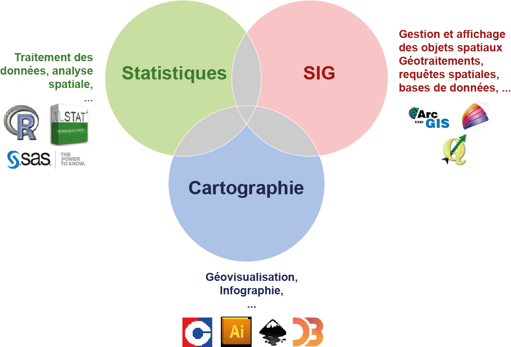
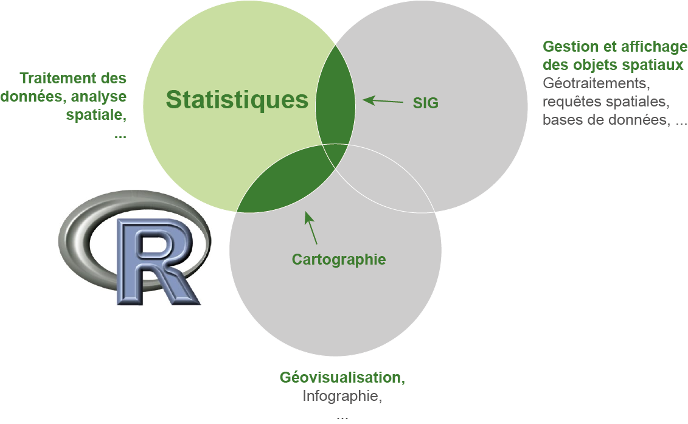
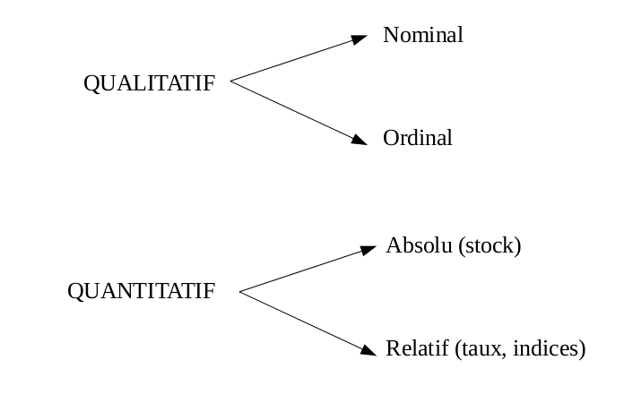
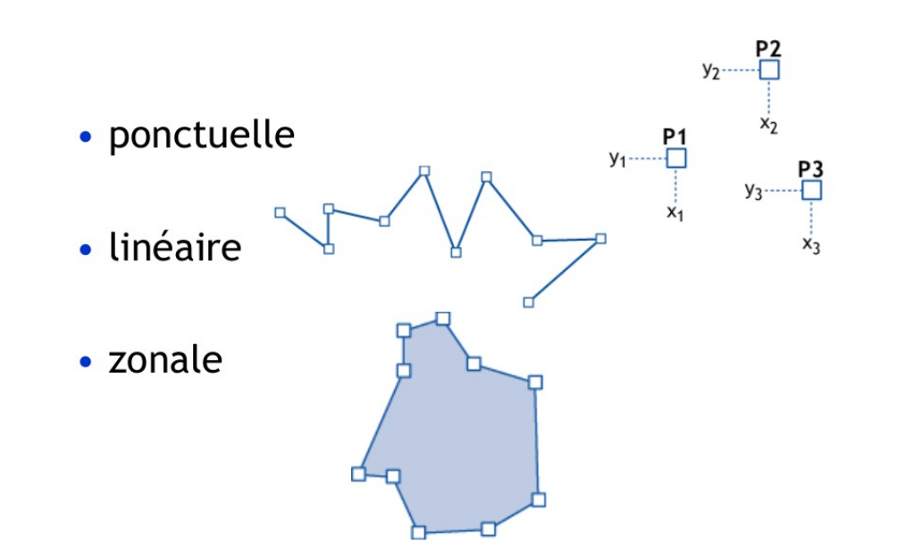
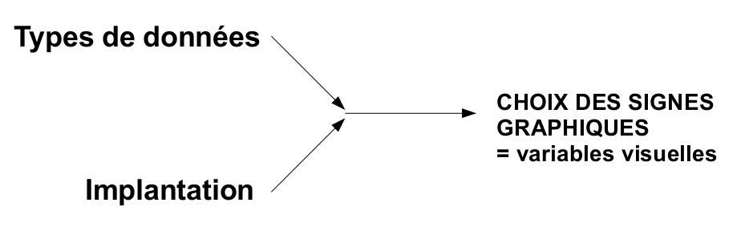
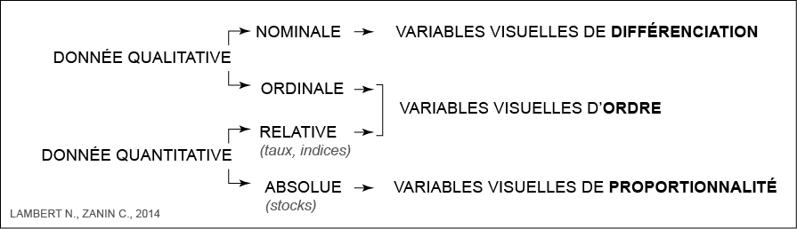

```{r knitr_init, echo=FALSE, cache=FALSE}
library(knitr)
library(rmdformats)
## Global options
options(max.print="75")
opts_chunk$set(echo=TRUE,
	             cache=TRUE,
               prompt=FALSE,
               tidy=TRUE,
               comment=NA,
               message=FALSE,
               warning=FALSE, 
               fig.width=6)
opts_knit$set(width=75)

knit_hooks$set(par = function(before, options, envir){
if (before){
  par(mar=c(0,0,0,0))
  } 
})

knit_hooks$set(par.title = function(before, options, envir){
if (before){
  par(mar=c(0,0,1.2,0))
  } 
})

```


# R
```{r, out.width = 800, fig.retina = NULL, echo=FALSE}

```


**R est un outil parmis d'autres dans la chaine de traitement géographique.**   
Il existe de nombreux logiciels correspondants à differents métiers, des chaînes de traitement parfois complexes.

</br></br></br></br></br></br></br></br></br></br></br></br></br></br></br></br></br></br></br></br></br></br></br></br></br></br></br></br></br></br></br></br>

```{r, out.width = 800, fig.retina = NULL, echo=FALSE}

```

**R permet de simplifer les chaînes de traitement** en travaillant dans un environnement intégré basé sur un seul langage, un seul logiciel. 

</br></br></br></br></br></br></br></br></br></br></br></br></br></br></br></br></br></br></br></br></br></br></br></br></br></br></br></br></br></br></br></br>

# Les fonctionnalités spatiales de R
Trois packages sont incontournables.

## Le package `rgdal`, import/export d'objets spatiaux et gestion des projections cartographiques

`rgdal` est une interface entre R et les librairies GDAL ([Geospatial Data Abstraction Library](http://www.gdal.org/)) et [PROJ4](https://github.com/OSGeo/proj.4).


#### Import du shapefile des régions européennes (NUTS3) :
```{r ImportShp, cache = TRUE}
library("rgdal")
nuts3 <- readOGR(dsn = "data", layer = "nuts3", verbose = TRUE)
```

</br></br></br></br></br></br></br></br></br></br></br></br></br></br></br></br></br></br></br></br></br></br></br></br></br></br></br></br></br></br></br></br>

## Le package `sp`, manipulation et affichage d'objets spatiaux

`sp` fournit des classes et des methodes pour les données spatiales dans R.


#### Affichage des NUTS3 :
```{r InspectSPDF, par = TRUE, cache = TRUE}
library("sp")
class(nuts3)
nuts3@proj4string
nuts3@bbox
head(nuts3@data)
plot(nuts3)
plot(nuts3, col = "#DAE3E6", border = "#8A0641", lwd = 0.5)
```

</br></br></br></br></br></br></br></br></br></br></br></br></br></br></br></br></br></br></br></br></br></br></br></br></br></br></br></br></br></br></br></br>

## Le package `rgeos`, géotraitements

`rgeos` donne accès à la librairie d'opérations spatiales GEOS ([Geometry Engine - Open Source](http://trac.osgeo.org/geos/)) qui permet notamment d'effectuer les géotraitements suivants :  

* Area / Perimeter 
* Distances  
* **Buffer**
* Overlap / intersect / difference
* Contains / within
* Union
* **Dissolve**
* ...

#### Agrégation des polygones / dissolve

```{r dissolve, par = TRUE, cache = TRUE }
library("rgeos")
europe <- gUnaryUnion(spgeom = nuts3)
plot(nuts3, lwd = 0.5)
plot(europe, lwd = 2, border = "red", add=T)
```

#### Création de zones tampons / buffer
```{r buffer, par = TRUE, cache = TRUE}
library("rgeos")
europeBuffer <- gBuffer(spgeom = europe, width = 50000)
plot(europe, col = "#92C5D6")
plot(europeBuffer, add = T, border = "red")
```

</br></br></br></br></br></br></br></br></br></br></br></br></br></br></br></br></br></br></br></br></br></br></br></br></br></br></br></br></br></br></br></br>


</br></br></br></br></br></br></br></br></br></br></br></br></br></br></br></br></br></br></br></br></br></br></br></br></br></br></br></br></br></br></br></br>

# Rappel de cartographie / sémiologie graphique

```{r, out.width = 800, fig.retina = NULL, echo=FALSE}

```

Les données géographiques sont de **quatre** types.   
A chaque type s'applique un **traitement statistique et graphique** de l'information spécifique.

</br></br></br></br></br></br></br></br></br></br></br></br></br></br></br></br></br></br></br></br></br></br></br></br></br></br></br></br></br></br></br></br>

```{r, out.width = 800, fig.retina = NULL, echo=FALSE}

```

Les données géographiques s'appliquent à 3 types d'objets géométriques que l'on peut classer selon leur nombre de dimension sur un plan : **le point, la ligne, le polygone**. 

</br></br></br></br></br></br></br></br></br></br></br></br></br></br></br></br></br></br></br></br></br></br></br></br></br></br></br></br></br></br></br></br>

```{r, out.width = 800, fig.retina = NULL, echo=FALSE}

```

Le **type de donnée** associé au type d'**implantation graphique** détéremine le(s) mode(s) de représentation cartographique possible(s).   

>« La graphique utilise les propriétés de l'image visuelle pour faire apparaitre les relations de *différence*, d'*ordre* et de *proportionnalité* entre les données » (J. Bertin)

```{r, out.width = 800, fig.retina = NULL, echo=FALSE}

```


</br></br></br></br></br></br></br></br></br></br></br></br></br></br></br></br></br></br></br></br></br></br></br></br></br></br></br></br></br></br></br></br>

# Le package `cartography`

Conçu comme une boite à outil dédiée à la **cartographie thématique**, le package [`cartography`](https://cran.r-project.org/web/packages/cartography/index.html) est développé au sein de l'[UMS RIATE](http://www.ums-riate.fr) (CNRS, CGET, Université Paris Diderot) par Nicolas Lambert et Timothée Giraud. 

</br></br></br></br></br></br></br></br></br></br></br></br></br></br></br></br></br></br></br></br></br></br></br></br></br></br></br></br></br></br></br></br>

### Installation 
La version stable est [sur le CRAN](https://cran.r-project.org/web/packages/cartography/index.html).

```{r install, eval = FALSE, cache = TRUE}
install.packages("cartography")
```

La version de développement est hébergée sur [GitHub](https://github.com/Groupe-ElementR/cartography).   
```{r install2, eval = FALSE, cache = TRUE}
require(devtools)
devtools::install_github("Groupe-ElementR/cartography")
```

Vous pouvez nous faire remonter d’éventuels bugs [ici](https://github.com/Groupe-ElementR/cartography/issues/).

</br></br></br></br></br></br></br></br></br></br></br></br></br></br></br></br></br></br></br></br></br></br></br></br></br></br></br></br></br></br></br></br>

## Les données 
Les exemples utilisent les jeux de données fournis avec le package. 
Ces données portent sur les maillages régionaux européens [NUTS](http://ec.europa.eu/eurostat/fr/web/nuts/overview). 
```{r cleaning, eval=TRUE, echo=FALSE, cache = FALSE}
rm(list = ls())
```

```{r load, par.title = TRUE, cache = FALSE}
# Chargement de la librairie
library(cartography)

# Import de données dans la session
data(nuts2006)

ls()
```

Les objets terminant par ".spdf"" sont des objets spatiaux et ceux terminant par ".df" sont des data frames. 

</br></br></br></br></br></br></br></br></br></br></br></br></br></br></br></br></br></br></br></br></br></br></br></br></br></br></br></br></br></br></br></br>


## Carte Choroplethes

```{r choroMap, par.title = TRUE, cache = TRUE}
# Calcul du taux de croissance annuel moyen
nuts2.df$cagr <- 100 * (((nuts2.df$pop2008 / nuts2.df$pop1999)^(1/9)) - 1) 

# Cartographie
choroLayer(spdf = nuts2.spdf, df = nuts2.df, var = "cagr")
title("Taux de croissance en Europe")
```


Après ce premier jet, il est ensuite possible de paramétrer très finement la carte : palette de couleurs, discrétisation, légende, couches d'habillage...

```{r choroMap2, par.title = TRUE, cache = TRUE}
# Construire une palette de couleurs
cols <- carto.pal(pal1 = "green.pal", n1 = 2, 
                  pal2 = "red.pal", n2 = 4) 

# Affichage de couches d'habillage
plot(nuts0.spdf, border = NA, col = NA, bg = "#A6CAE0")
plot(world.spdf, col  = "#E3DEBF", border=NA, add=TRUE)

# Cartographie du taux de croissance annuel moyen
choroLayer(spdf = nuts2.spdf, df = nuts2.df, var = "cagr",#
           breaks = c(-2.43,-1.0,0.0,0.5,1.0,2.0,3.1), 
           col = cols,
           border = "grey40",
           lwd = 0.5, 
           legend.pos = "right",
           legend.title.txt = "taux de croissance\nannuel moyen", 
           legend.values.rnd = 2, 
           add = TRUE) 

# Affichage de couches d'habillage
plot(nuts0.spdf,border = "grey20", lwd=0.75, add=TRUE)

# Ajout des titres, légende, sources, etc.
layoutLayer(title = "Taux de croissance en Europe", 
            author = "cartography", 
            sources = "Eurostat, 2008", frame = TRUE, col = NA, 
            scale = NULL,coltitle = "black",
            south = TRUE) 

```

</br></br></br></br></br></br></br></br></br></br></br></br></br></br></br></br></br></br></br></br></br></br></br></br></br></br></br></br></br></br></br></br>

## Cartes en symboles proportionnels

Cartographie d'un stock (la population nationale) avec des figurés proportionnels.

```{r propMap, par.title = TRUE, cache = TRUE, fig.width=6}

# Affichage de couches d'habillage
plot(nuts0.spdf, border = NA, col = NA, bg = "#A6CAE0")
plot(world.spdf, col  = "#E3DEBF", border=NA, add=TRUE)
plot(nuts0.spdf, col = "#D1914D",border = "grey80", add=TRUE)

# Cartographie de la population des pays en cercles proportionnels
propSymbolsLayer(spdf = nuts0.spdf, df = nuts0.df,#
                 var = "pop2008", 
                 symbols = "circle", col =  "#920000",
                 legend.pos = "right",
                 legend.title.txt = "Total\npopulation (2008)",
                 legend.style = "c")

# Ajout des titres, légende, sources, etc.
layoutLayer(title = "Countries Population in Europe",
            author = "cartography",
            sources = "Eurostat, 2008",
            scale = NULL,
            south = TRUE)
```

</br></br></br></br></br></br></br></br></br></br></br></br></br></br></br></br></br></br></br></br></br></br></br></br></br></br></br></br></br></br></br></br>

## Cartes de flux

Il s'agit de représenter des données, agrégées à un niveau régional, sur les jumelages entre villes. 
```{r linkMap, par.title = TRUE, cache = TRUE}
# Données sur les jumelages
head(twincities)

# Creation d'une couche de liens
twincities.spdf <- getLinkLayer(spdf = nuts2.spdf, df = twincities) 

# Affichage des liens créés
plot(twincities.spdf, lwd = 0.2)

# Affichage de couches d'habillage
plot(nuts0.spdf, border = NA, col = NA, bg = "#A6CAE0")
plot(world.spdf, col  = "#E3DEBF", border=NA, add=TRUE)
plot(nuts2.spdf, col = "#D1914D",border = "grey80", add=TRUE)

# Cartographie des liens
gradLinkLayer(spdf = twincities.spdf, df = twincities,   #
              spdfids = "i", spdfide = "j", dfids = "i", dfide = "j", 
              var = "fij", 
              breaks = c(2,5,15,20,30), 
              lwd = c(0.1,1,4,10), 
              col = "#92000090",
              legend.pos = "right", legend.frame = TRUE,
              legend.title.txt = "Number of Agreements\n(regional level)",
              add = TRUE)

# Ajout des titres, légende, sources, etc.
layoutLayer(title = "International Twinning Agreements Between Cities", 
            author = "cartography", 
            sources = "Sources: Adam Ploszaj & Wikipedia, 2011",
            scale = NULL, south = TRUE, frame = TRUE, col = NA, 
            coltitle = "black")
```

</br></br></br></br></br></br></br></br></br></br></br></br></br></br></br></br></br></br></br></br></br></br></br></br></br></br></br></br></br></br></br></br>


## Discontinuités

Discontinuités de richesses entre Etats.

```{r disc, par.title = TRUE, cache = TRUE}
# Construction les polylignes des frontières inter-étatiques
nuts0.contig.spdf <- getBorders(nuts0.spdf)

plot(nuts0.spdf, bg = "#A6CAE0", col = "#D1914D",border = "grey80")
plot(nuts0.contig.spdf, col = 1:nrow(nuts0.contig.spdf), lwd = 2, add=TRUE)

head(nuts0.contig.spdf@data)

# Calcul du PIB/habitant
nuts0.df$gdpcap <- nuts0.df$gdppps2008/nuts0.df$pop2008*1000000

# Affichage de couches d'habillage
plot(nuts0.spdf, border = NA, col = NA, bg = "#A6CAE0")
plot(world.spdf, col  = "#E3DEBF", border=NA, add=TRUE)

# Cartographie du PIB/habitants
choroLayer(spdf = nuts0.spdf, df = nuts0.df, var = "gdpcap", #
           border = "grey80",
           col = carto.pal(pal1 = "kaki.pal", n1 = 6), 
           method = "quantile",
           nclass = 6, add=TRUE, 
           legend.pos = "right", 
           legend.values.rnd = -2,
           legend.title.txt = "GDP per Capita\n(in euros)")

# Plot discontinuities
discLayer(spdf = nuts0.contig.spdf, df = nuts0.df, var = "gdpcap", 
          type = "rel", 
          method = "equal", 
          nclass = 4, 
          threshold = 0.5, 
          sizemin = 0.5, 
          sizemax = 6, 
          col="red",
          legend.values.rnd = 1,
          legend.title.txt = "Discontinuities in \nGDP per Capita\n(relative)",
          legend.pos = "topright", 
          add=TRUE)

# Ajout des titres, légende, sources, etc.
layoutLayer(title = "Wealth Disparities in Europe",
            coltitle = "black", col = NA,
            sources = "Eurostat, 2011", 
            scale = NULL,
            author = "cartography", 
            frame = FALSE)

```

</br></br></br></br></br></br></br></br></br></br></br></br></br></br></br></br></br></br></br></br></br></br></br></br></br></br></br></br></br></br></br></br>


## Carroyages

Transformation de données dans un maillage hétérogène vers une grille régulière. 

```{r grid, par.title = TRUE, cache = TRUE}
# Creation d'une grille régulière
mygrid <- getGridLayer(spdf=nuts2.spdf, cellsize = 200000)

# Affichage de la grille
plot(mygrid$spdf)

# Adaptation des données à la grille
datagrid.df <- getGridData(x = mygrid, df = nuts2.df, var = "pop2008") 
datagrid.df$densitykm <- datagrid.df$pop2008_density*1000*1000

# Affichage de couches d'habillage
plot(nuts0.spdf, border = NA, col = NA, bg = "#A6CAE0")
plot(world.spdf, col  = "#E3DEBF", border=NA, add=TRUE)

# Cartographie de la densité de population 
choroLayer(spdf = mygrid$spdf,                         #
           df = datagrid.df,
           var = "densitykm", 
           border = "grey80", 
           col = carto.pal(pal1 = "wine.pal", n1 = 6), 
           legend.pos = "topright",
           method = "q6", add = TRUE,
           legend.title.txt = "Population Density\n(inhabitant/km²)")

# Ajout des titres, légende, sources, etc.
layoutLayer(title = "Population Density", 
            coltitle = "black", col = NA,
            sources = "Eurostat, 2011", scale = NULL, 
            author = "cartography", frame = FALSE)
```

</br></br></br></br></br></br></br></br></br></br></br></br></br></br></br></br></br></br></br></br></br></br></br></br></br></br></br></br></br></br></br></br>


## Fonds de carte OpenStreetMap

Import de tuiles issues d'OpenStreetMap

```{r osm, par = TRUE, cache = TRUE, fig.width=5, fig.height=5}
data("nuts2006")
# extract Denmark
spdf <- nuts0.spdf[nuts0.spdf$id=="DK",]   
# Download the tiles, extent = Denmark 
den <- getTiles(spdf = spdf, type = "osmtransport", crop = TRUE, zoom = 7)
class(den)
# Plot the tiles
tilesLayer(den)
# Plot countries
plot(spdf, border = "red", lwd = 2, add=TRUE)
# Map tiles sources
mtext(text = "Map data © OpenStreetMap contributors, under CC BY SA.",
      side = 1, adj = 0, cex = 0.7, font = 3, line = -2)

```

</br></br></br></br></br></br></br></br></br></br></br></br></br></br></br></br></br></br></br></br></br></br></br></br></br></br></br></br></br></br></br></br>

# Cas d'usage 
**Etude de la répartition des ouvriers en Ile-de-France**

## Import des données
```{r importidf, par = TRUE, cache = TRUE}
# Import du fond de carte communal d'IDF (source : IGN)
library(rgdal)
library(sp)
comidf.spdf <- readOGR(dsn = "data/", layer = "idf",verbose = F)
plot(comidf.spdf)
head(comidf.spdf@data)

# Création d'une couche du contour de l'idf
library(rgeos)
idf.spdf <- gUnaryUnion(comidf.spdf)
plot(comidf.spdf)
plot(idf.spdf, lwd = 4, border = "red", add = TRUE)


# Import des données sur les communes (source : INSEE 2011)
comidf <- read.csv("data/idfdata.csv")
head(comidf)
```


## Répartition des ouvriers (valeur absolue)

```{r plotouv, par.title = TRUE, cache = TRUE}
library(cartography)
plot(idf.spdf, col = "grey80")
propSymbolsLayer(spdf = comidf.spdf, df = comidf,     #
                 var = "ouvrier", 
                 col = "#920000", legend.pos = "topright",inches = 0.15, 
                 legend.title.txt = "Nombre d'ouvriers")
layoutLayer(title = "Répartition des ouvriers en Ile-de-France", 
            col = "#080E5B",
            sources = "Insee, 2011", author = "T. Giraud", 
            frame = T)


```


## Part des ouvriers dans la population
```{r plotouv2, par.title = TRUE, cache = TRUE}
# Calcul de la part des ouvriers dans la population active occupée
comidf$partouvrier <- comidf$ouvrier/comidf$total * 100

# discrétisation en quantiles de la distribution de la part des ouvriers
bks <- quantile(comidf$partouvrier, seq(0,1,length.out = 9))

# création d'une palette de couleurs
cols <- carto.pal(pal1 = "turquoise.pal", n1 = length(bks)-1)

# Affichage de la carte
choroLayer(spdf = comidf.spdf, df = comidf,             #
           col = cols, border = "grey50",
           legend.title.txt = "Part des ouvriers\n(en %)", 
           legend.pos = "topright",
           legend.title.cex = 0.7, 
           var = "partouvrier", breaks = bks)
layoutLayer(title = "Répartition des ouvriers en IDF",col = "#080E5B",
            sources = "Insee, 2011", author = "T. Giraud", 
            frame = T)

```

## Combinaison du nombre et de la part des ouvriers
```{r plotouv3, par = TRUE, cache = TRUE}
# Affichage de la carte
plot(idf.spdf, col = "grey80")
propSymbolsChoroLayer(spdf = comidf.spdf, df = comidf,                       #
                      var = "ouvrier", var2 = "partouvrier",
                      col = cols, border = "grey50", inches = 0.15,
                      breaks = bks, legend.var2.values.rnd = 0,
                      legend.var.title.txt = "Nombre\nd'ouvriers", 
                      legend.var2.title.txt = "Part des ouvriers",
                      legend.var.pos = "bottomright",
                      add=TRUE)
```

## Part potentiel d'ouvrier dans un voisinnage

Des modèles d’interaction spatiale permettant de saisir l’influence exercée par un lieu sur tous les autres.

Le modèle de Stewart (accessibilité potentielle, potentiel gravitationnel ou accessibilité gravitationnelle) :

$$
A_i = \sum_{j=1}^n O_j f(d_{ij})
$$

- $A_i$ potentiel en $i$
- $O_j$ stock de population sur $j$ 
- $f(d_{ij})$ fonction négative de la distance entre $i$ et $j$


### Potentiel dans un maillage
```{r plotouvpot, par.title = TRUE, cache = TRUE}
library(SpatialPosition)
# Jointure fond de carte / données
comidf.spdf@data <- data.frame(comidf.spdf@data, 
                               comidf[match(comidf.spdf@data$ID,comidf$ID), -1])
row.names(comidf.spdf) <- as.character(comidf.spdf@data$ID)
head(comidf.spdf@data)

# Potentiel d'ouvriers dans un voisinnage de 7.5 kilomètres
ouv <- stewart(knownpts = comidf.spdf, unknownpts = comidf.spdf,          #
               typefct = "exponential",
               varname = "ouvrier", span = 7500, beta = 3)
# Potentiel de population active dans un voisinnage de 7.5 kilomètres
tot <- stewart(knownpts = comidf.spdf, unknownpts = comidf.spdf,               #
               typefct = "exponential",
               varname = "total", span = 7500, beta = 3)
pot <- data.frame(id = tot$ID, partouvrierpot = ouv$OUTPUT/tot$OUTPUT * 100)

# cartographie
choroLayer(spdf = comidf.spdf, df = pot,              #
           border = NA,
           legend.title.txt = "Part des\nouvriers\n(en %)*", 
           legend.pos = "left",
           legend.title.cex = 0.7, 
           var = "partouvrierpot", 
           breaks = bks, add=F)
titre <- "Répartition des ouvriers en IDF - Voisinnage de 7.5 kilomètres"
layoutLayer(title = titre,
            col = "#080E5B",
            sources = "* Fonction d'interaction spatiale : exponentielle
  Facteur d'impédence (beta) : 3
  Portée : 7.5 kilomètres
  Sources : Insee, 2011", author = "T. Giraud", 
            frame = T, south = T)

```


### Potentiel sur une surface continue
```{r plotouvpot2, par.title = TRUE, cache = TRUE}

pot.spdf <- quickStewart(spdf = comidf.spdf, df = comidf.spdf@data,                #
                         var = "ouvrier", var2 = "total", breaks = bks/100,
                         span = 7500, beta = 3, mask = idf.spdf)
breaks <- sort(c(unique(pot.spdf$min), max(pot.spdf$max)), decreasing = FALSE)
cartography::choroLayer(spdf = pot.spdf, df = pot.spdf@data,              #
                        var = "center", breaks = breaks, border = NA, 
                        legend.pos = "left", legend.values.rnd = 2,
                        legend.title.txt = "Part des\nouvriers\n(en %)*")

  titre <- "Répartition des ouvriers en IDF - Voisinnage de 7.5 kilomètres"
layoutLayer(title = titre,
            col = "#080E5B",
            sources = "* Fonction d'interaction spatiale : exponentielle
  Facteur d'impédence (beta) : 3
  Portée : 7.5 kilomètres
  Sources : Insee, 2011", author = "T. Giraud", 
            frame = T, south = T)
plot(idf.spdf, add=T)

```


## Discontinuités dans la répartition des ouvriers


```{r plotouvcon, par.title = TRUE, cache = TRUE, fig.with=7}
# extraction de la zone Paris et petite couronne
comppc.spdf <- comidf.spdf[substr(comidf.spdf$ID,1,2) %in% c("75", "92", "93", "94"), ]

# extraction de frontières de polygones
ppccomcontig <- getBorders(spdf = comppc.spdf)

# téléchargement d'une tuile osm
osm <- getTiles(spdf = comppc.spdf, type = "mapquestosm", crop = TRUE, zoom = 11)
tilesLayer(osm)

# affichage de la part des ouvriers
choroLayer(spdf = comppc.spdf, df = comidf, var = "partouvrier",  #
           border = NA,
           col = paste0(carto.pal(pal1 = "wine.pal", n1 = 6),"CC"), 
           method = "quantile",
           nclass = 6,
           legend.pos = "topleft", legend.frame = TRUE, add=TRUE,
           legend.title.txt = "Part des ouvriers")

# affichage des discontinuités
discLayer(spdf = ppccomcontig, df = comidf, var = "partouvrier", 
          type = "rel", 
          method = "equal", 
          nclass = 4, 
          threshold = 0.4, 
          sizemin = 1, 
          sizemax = 6, 
          col="blue",
          legend.values.rnd = 1, legend.frame = TRUE,
          legend.title.txt = "Discontinuités dans\nla part des ouvriers",
          legend.pos = "topright", 
          add=TRUE)

```

## Un peu d'interactivité?

```{r plotouvinter, cache=FALSE}
library(leaflet)
# initialiser une carte
m <- leaflet()
# carte avec emprise mondiale
m <- addTiles(map = m)
# centrer sur un point
m <- setView(map = m, lng = 2.519182, lat = 48.896768, zoom = 12)
# ajout d'une couche de poly
m <- addPolygons(map = m,                                                  #
                 data = spTransform(comppc.spdf, "+init=epsg:4326"), 
                 opacity = 0.5,
                 color = "blue", stroke = TRUE,
                 weight = 2, popup = NULL,
                 options = list(clickable = FALSE),
                 fill = T, fillColor = "#B3C4B3",
                 fillOpacity = 0.2)

# ajout d'un pop-up
m <- addPopups(map = m, lng = 2.519182, lat = 48.896768, 
               popup = '<a href="https://fr.wikipedia.org/wiki/Le_Raincy">
               "Le Petit Neuilly du 93"</a>')


# affichage de la carte
m
```


</br></br></br></br></br></br></br></br></br></br></br></br></br></br></br></br></br></br></br></br></br></br></br></br></br></br></br></br></br></br></br></br>


# Quelques ressources en ligne

* [R-sig-Geo Mailing list](https://stat.ethz.ch/mailman/listinfo/r-sig-geo) *R Special Interest Group on using Geographical data and Mapping*.  
*Mailing list* dédiée aux discussions sur l'utilisation des packages et données géographiques dans R  
* [CRAN Task View: Analysis of Spatial Data](https://cran.r-project.org/web/views/Spatial.html)  
Suivi des packages portant sur l'analyse des données spatiales.
* [R-bloggers](http://www.r-bloggers.com/)  
Agrégateur de blogs sur R, généraliste mais les post géographiques sont assez fréquents.  
* [Bivand, R.S., Pebesma, E.J., and Gomez-Rubio, V. (2013). *Applied spatial data analysis with R*. 2nd ed. New York: Springer-Verlag.](http://link.springer.com/book/10.1007/978-1-4614-7618-4)  
Ouvrage de référence sur l'analyse de données spatiales avec R.     
* [Le Groupe ElementR](http://elementr.hypotheses.org/)  
Les activités de ce groupe consistent à organiser des séances de formation et à produire des matériaux pédagogiques sur l’utilisation du logiciel R en sciences humaines et sociales. Exemples de séances :  
    * Recherche reproductible et création de packages   
    * Régression multiniveaux  
    * Analyse de flux et modèles gravitaires  
    * Analyse de données spatio-temporelles  
    * Cartographie de flux  
    * Créer des applications interactives avec R et shiny
    * Analyse de rasters  
    * Extraction de contenus web - web scraping
* [ElementR, G. (2014). *R et espace: traitement de l'information géographique*. Framasoft.](http://framabook.org/r-et-espace/)  
Ouvrage du Groupe ElementR.  
* [Lambert, N., Zanin, C. (2016). *Manuel de cartographie - Principes, méthodes, applications*. Armand Colin.](http://www.armand-colin.com/manuel-de-cartographie-principes-methodes-applications-9782200612856)  
Manuel de cartographie.  


</br></br></br></br></br></br></br></br></br></br></br></br></br></br></br></br></br></br></br></br></br></br></br></br></br></br></br></br></br></br></br></br>

#### Merci de votre attention! 

Le package sur GitHub : [https://github.com/Groupe-ElementR/cartography/](https://github.com/Groupe-ElementR/cartography/)  

Carnet de recherche R Géomatique : [http://rgeomatic.hypotheses.org/](http://rgeomatic.hypotheses.org/)  

</br></br></br></br></br></br></br></br></br></br></br></br></br></br></br></br></br></br></br></br></br></br></br></br></br></br></br></br></br></br></br></br>


